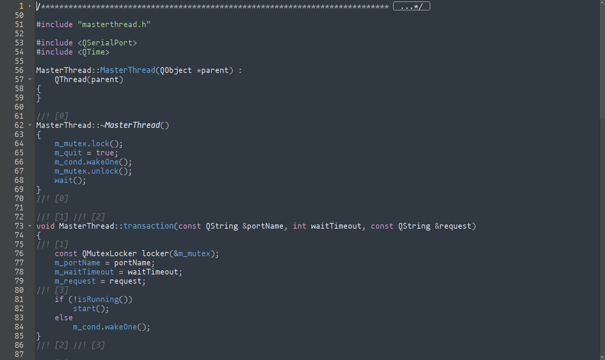

# QT Dark Theme
QT语法高亮主题

颜色仿的Sublime Text中的主题，只修改了最常见的部分, .xml中加了注释方便自己自定义

The color theme is based on SublimeText's mariana theme.

食用方法: 下载WoodeCode_Dark.xml文件，将文件放到下面的目录中

Installation:Copy the .xml file into the styles directory:
```
C:\Qt\Qt5.14.2\Tools\QtCreator\share\qtcreator\styles
```
OR
```
C:\Users\×××\AppData\Roaming\QtProject\qtcreator\styles
```
Qt Creator -> 工具 -> 选项 -> 文本编辑器 -> 字体和颜色 -> 选择"WoodeCode_Dark"

In Qt Creator go to Tools -> Options -> Text Editor -> Font & Colors and select Monokai under "Color Scheme".

```
  ...
  <style name="Number" foreground="#f9ae57"/><!--数字@@-->
  <style name="String" foreground="#99c794"/><!--字符串@@-->
  <style name="Type" foreground="#d8dee9"/><!--类型-->
  <style name="Local" foreground="#d8dee9"/><!--局部变量-->
  <style name="Global" foreground="#9aa7d6"/><!--全局变量-->
  <style name="Field" foreground="#6699cc"/><!--字段，类的数据成员-->
  ...
```

